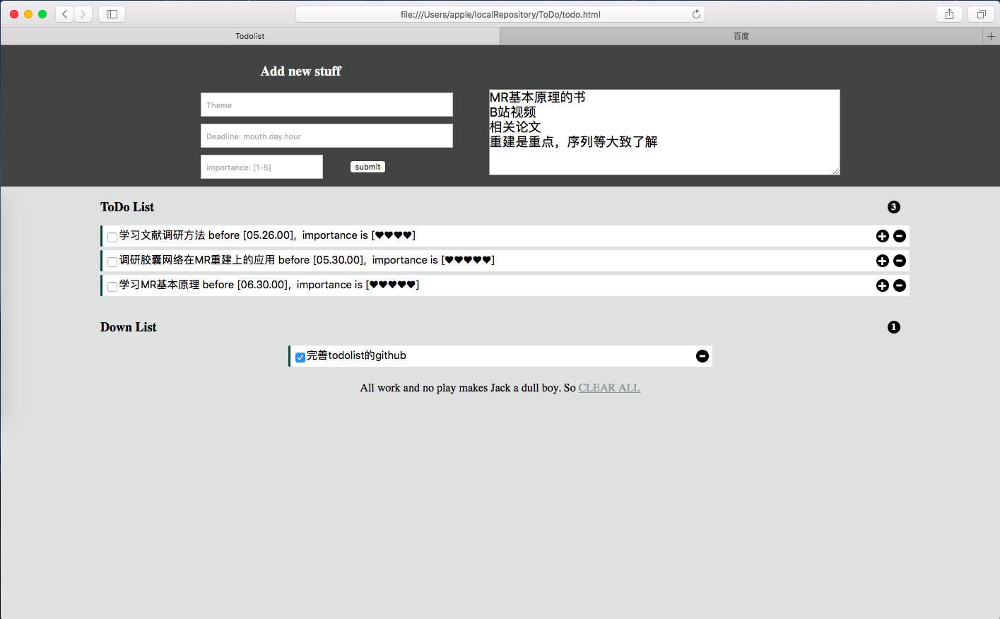

# ToDOlist

> chan 2020/05/25
>
> reference: http://www.todolist.cn
>
> This is a ToDOlist  shown on your safari screen and regulate your list according to Stephen Covey's 4 Quadrants Time Management Strategies.

### Introduction

****

#### User interface

#### Usage

This is only a offline tool to help you to regulate your tasks and all data will be saved  in your localstorage of browser. you can use it as follow steps.

- download the repository and save them in an appropriate place in your computer.
- open the todo.html with your favorite browser and add a bookmark to the address.
- fill some tasks into the top blanks, please remember:
  - Deadline and Importance number should meet the requirements.
  - specific description is not necessary.
  - after filling, click submit to save data and tasks will shown on the ToDO list.
  - click '+'  to show details about the task and '-' to delete task.
  - DON'T CLICK 'CLEAR ALL' UNLESS YOU WANT TO BE A CLEVER JACK.
- open the saved address and you could check you todo list afterwards.

### Development

****

* [x] sort tasks by time .
* [ ] calculate and show the rest time of each tasks, update them each hours.
* [ ] draw a 4 Quadrants picture to show tasks.
* [ ] developments you suggested (you could contact me at 1066476363@qq.com or send message through github) 

### Change Log

****

#### 2020.05.25

- fix the time sort problem
- add necessary annotations